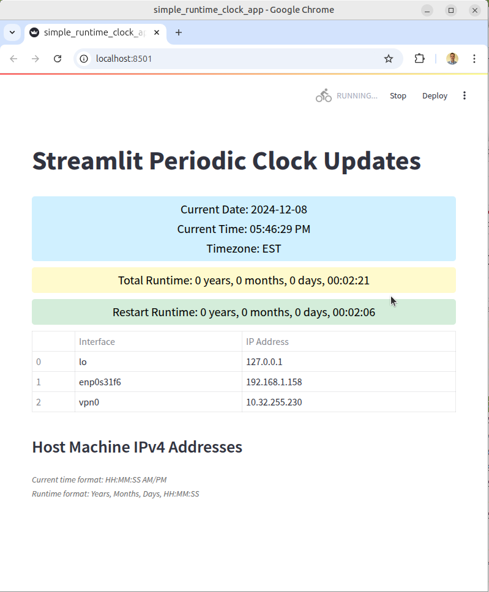

# Streamlit simple runtime clock app
This is a simple runtime clock app that updates each second to shows current time, timezone, and elapsed app runtime.

The table also shows a table of server or host IPv4 addresses so you know where and what machine it's running on.

### Dependencies:
- <code>psutil</code>
- <code>streamlit</code>

### Run with:
    
    streamlit run simple_runtime_clock_app.py

### Screenshot:

### Author:

    Marc Compere, comperem at erau.edu
    created : 08 Dec 2024
    modified: 08 Dec 2024

